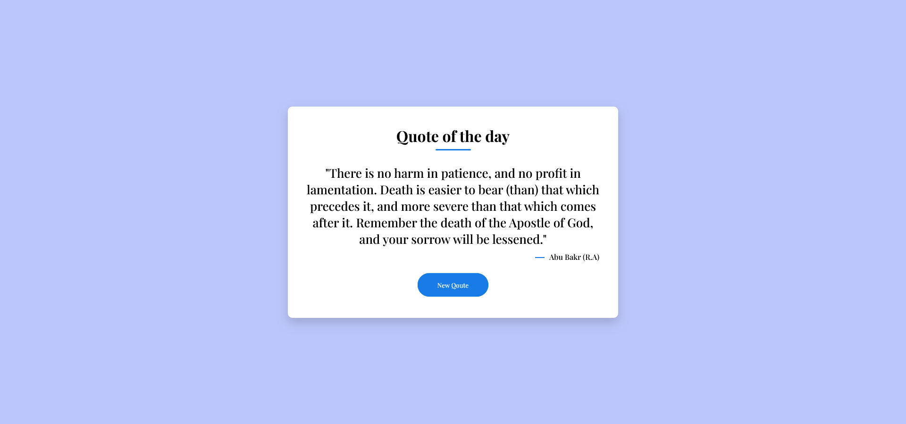

# Quote Generator App

A simple and elegant Quote Generator web application built using HTML5, CSS3, and JavaScript. The app fetches random quotes from an API and displays them along with the author's name. Users can click the "New Quote" button to get a fresh quote.

## Features

- Fetches random quotes from an API.
- Displays both the quote and the author's name.
- User-friendly interface with a clean design.
- Responsive layout.
- Asynchronous API call using JavaScript's Fetch API.

## Technologies Used

- HTML5
- CSS3
- JavaScript (Fetch API)

## How to Use

1. Clone or download this repository.
2. Open the `index.html` file in your browser.
3. Click the "New Quote" button to fetch a random quote.

## Demo Screenshot



## Setup Instructions

1. Clone the repository:
    ```bash
    git clone https://github.com/bahaamohammed/Quote-Generator-Web.git
    ```
2. Navigate to the project directory:
    ```bash
    cd Quote-Generator-Web
    ```
3. Open the `index.html` file in your browser to run the app locally.

## API

This project uses the [DummyJSON Quotes API](https://dummyjson.com/quotes) to retrieve random quotes.

## Project Structure

```bash
├── index.html    # The main HTML file
├── style.css     # CSS styles for the app
└── script.js     # JavaScript file for fetching and displaying quotes
